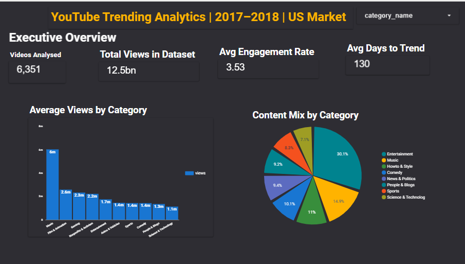
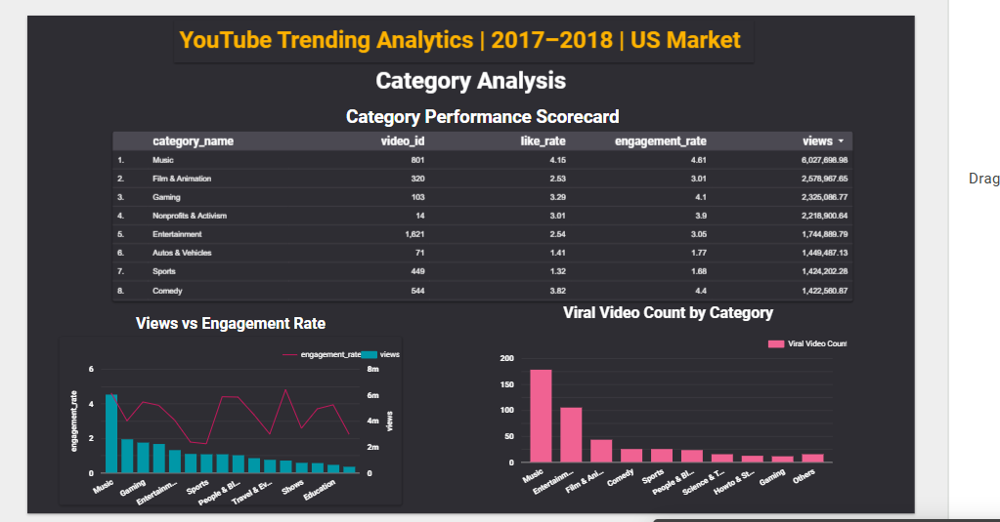
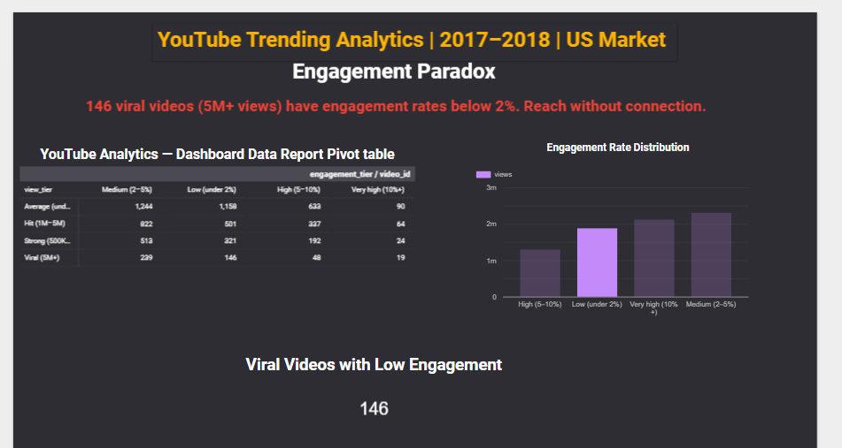
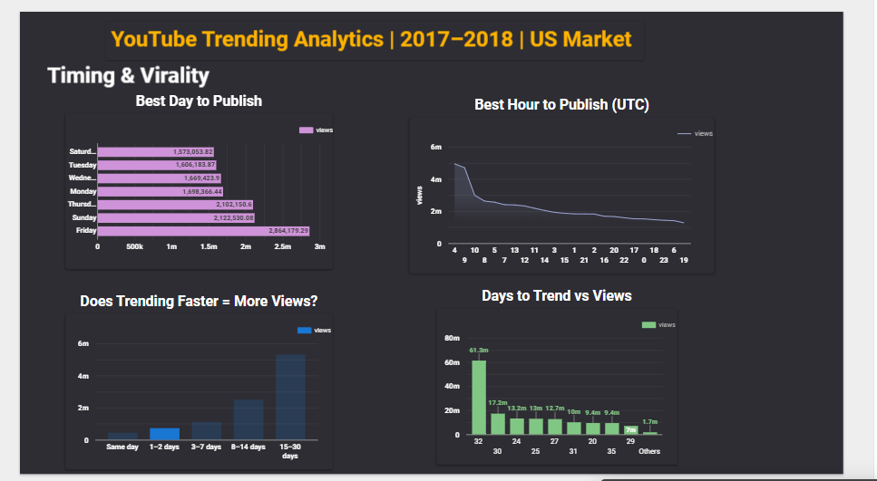

# Podcast & YouTube Engagement Analytics

> An end-to-end data analytics project investigating what drives
> high performance in trending YouTube videos — using Python,
> SQL, Pandas, Looker Studio.

---

## Project Overview

This project analyzes **6,351 trending YouTube videos** (US market,
Nov 2017 – Jun 2018) to answer a core business question:

> **What separates a high-performing trending video from an average one?**

Key findings:
- 🎮 Gaming videos achieve the highest median views (1.3M) despite
  representing only 1.6% of trending content
- 🎵 Music is the only category in the top 3 for both views AND
  engagement rate simultaneously
- 📰 News & Politics trends frequently but underperforms on views
  by 3× compared to the dataset median
- ⏱️ Videos that take longer to trend accumulate more total views
  (correlation: +0.345) — suggesting slow-burn evergreen content
  outperforms fast news spikes.
- 🤖 A Random Forest model predicts high vs low engagement with
    68% accuracy using only 9 features


---

## Tech Stack

| Tool | Purpose |
|---|---|
| Python 3.12 | Core analysis language |
| Pandas | Data cleaning and manipulation |
| NumPy | Numerical operations |
| Matplotlib + Seaborn | Data visualisation |
| scikit-learn | Machine learning model (Random Forest) |
| VADER NLP | Title sentiment analysis |
| SQLite | SQL analysis layer |
| Google Colab | Development environment |
| Looker Studio | Interactive dashboard |
| GitHub | Version control and portfolio |

---

## Project Structure

```
podcast-engagement-analytics/
│
├── notebooks/
│   ├── 01_data_cleaning.ipynb      ← Data cleaning pipeline
│   ├── 02_eda.ipynb                ← Exploratory data analysis
│   └── 03_advanced_features.ipynb  ← NLP + ML models
│
├── data/
│   ├── raw/                        ← Original dataset (Kaggle)
│   └── cleaned/                    ← Processed analysis-ready data
│
├── sql/
│   └── queries.sql                 ← 7 recruiter-worthy SQL queries
│
├── dashboard/
│   └── dashboard_link.md           ← Link to Looker Studio dashboard
│
└── images/screenshots/             ← All analysis charts
```

---

## Key Analyses

### 1. Engagement Distribution
Views follow a heavily right-skewed distribution — median views
(518K) are 3.8× lower than the mean (1.96M), driven by viral outliers.

### 2. Category Performance


### 3. Upload Timing Patterns


### 4. Title Sentiment vs Performance



---

## Data Quality

| Metric | Value |
|---|---|
| Source | Kaggle — Trending YouTube Video Statistics |
| Raw rows | 40,949 |
| Unique videos (after dedup) | 6,351 |
| Key columns complete | 100% |
| Date range | Nov 2017 – Jun 2018 |
| Categories | 16 |
| Unique channels | 2,199 |

---

## How to Run

1. Clone this repository
2. Open any notebook in [Google Colab](https://colab.research.google.com)
3. Upload `USvideos.csv` and `US_category_id.json` from
   [Kaggle](https://www.kaggle.com/datasnaek/youtube-new)
4. Run all cells in order

---

## Dashboard

👉 [View Interactive Dashboard](https://datastudio.google.com/reporting/760dc66a-8004-4fd6-8a02-c7c375b29acd)

---

## Key Insights
| # | Finding | Impact |
|---|---------|--------|
| 1 | Gaming = 1.3M median views despite 1.6% of content | Niche audiences over-deliver |
| 2 | Music ranks top 3 in both views & engagement | Safest dual-metric category |
| 3 | News trends 3× more but gets 3× fewer views | Frequency ≠ performance |
| 4 | Slower trending = more total views (+0.345) | Evergreen beats viral spikes |

## Future Improvements

- Integrate YouTube Data API v3 for real-time data refresh
- Expand to multi-country comparison (GB, IN, CA datasets available)
- Add comment sentiment analysis using the video comment threads
- Build a Streamlit web app for interactive exploration

---

## Author
Nagireddy Prameela Durga
Aspiring Data Analyst 

[LinkedIn](https://www.linkedin.com/in/prameelanagireddy/) · 
[Kaggle](https://www.kaggle.com/prameelanagireddy) · 
[Email](mailto:prameelanagireddy551@gmail.com)
